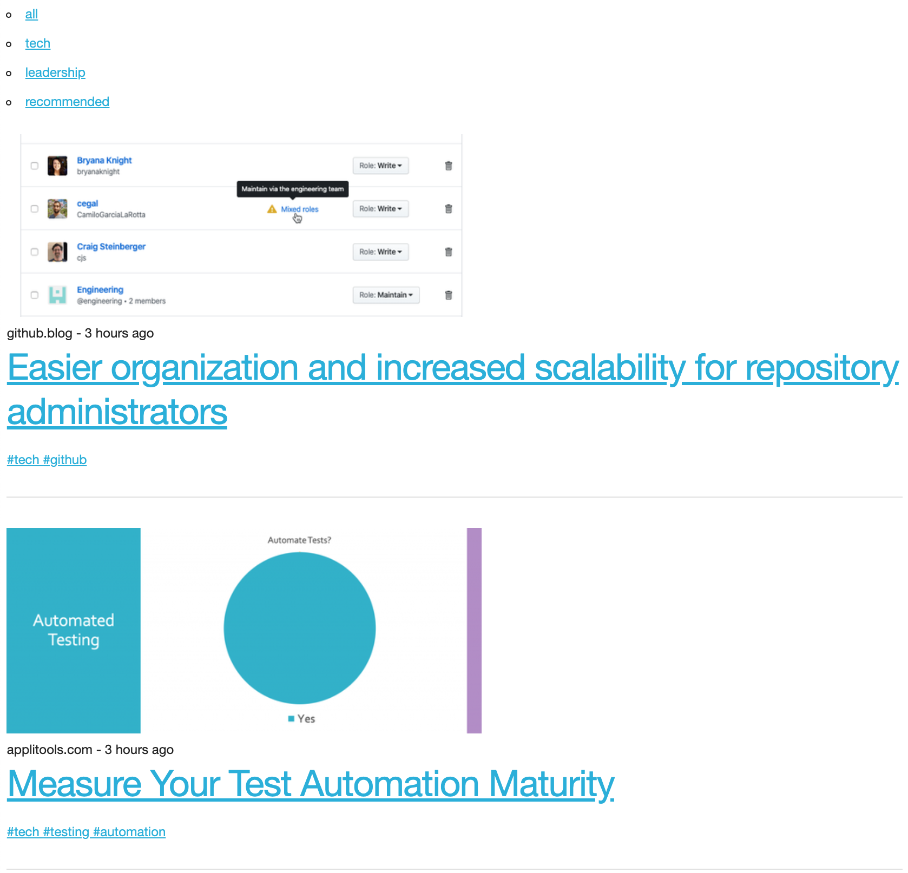

## Bookmarks (Template)
Generate a minimally styled view of bookmarks from a specified Pocket account with automatic subpath and filter creation.

Used to create and populate [annettemccullough.com/bookmarks](https://bookmarks.annettemccullough.com)

Content, categories and filters will be automatically populated based on any `#hashtags` added when a post is recommended.

All recommended posts, with or without tags will be available on the root path and in the specified `CATCH_ALL_CATEGORY`.

All tags will automatically act as filters on the content displayed on the current page, e.g. if a share has the tag `#aws`, then selecting this tag on a post will append `?tag=aws` to the current path, content will be filtered to posts with the `#aws` tag.

`categories` can be optionally configured to meaningfully group your bookmarks/recommendations. A sub-path will be automatically created for each category specified, any posts with a matching tag will appear on this sub-path.

`categories` will be displayed on every page allowing for 2 levels of filtering, e.g. if a share has the tag `#aws #cloud`, and `#cloud` is a configured category, then selecting this category will navigate to the auto-generated route `/cloud`, selecting the `#aws` tag on the post will append `?tag=aws` resulting in `/cloud?tag=aws`.

If both `#cloud` and `#aws` are configured as categories the post will be viewable in both `/cloud` and `/aws`, allowing posts to appear across as many relevant categories as is configured.


### configuration
See [.env.example](./.env.example)
```bash
# REQUIRED
PORT=8080

# REQUIRED
# this is the @ for the pocket account
# that content will be dervied from
# example:
# POCKET_ID=@annettemccullough
POCKET_ID=

# REQUIRED
# all posts will be displayed under this
# category, this allows for easier navigation
# back to all bookmarks after a category
# or filter has been applied
# example:
# CATCH_ALL_CATEGORY=all

CATCH_ALL_CATEGORY=

# OPTIONAL
# these categories will be displayed on the
# main bookmarks page to facilitate easier
# navigation through the main themes
# example:
# CATEGORIES='["serverless", "docker", "aws"]'

CATEGORIES=
```


### running locally
`cp .env.example .env`

`npm run dev`

### example

